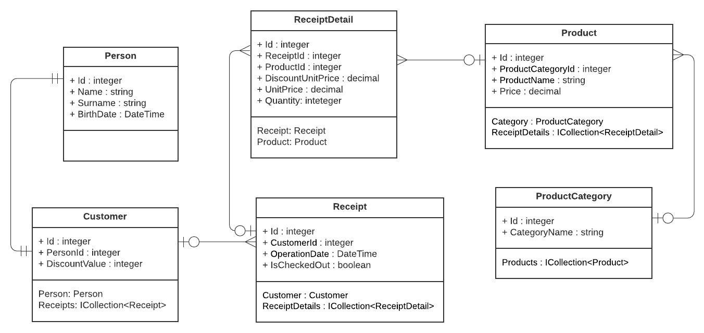
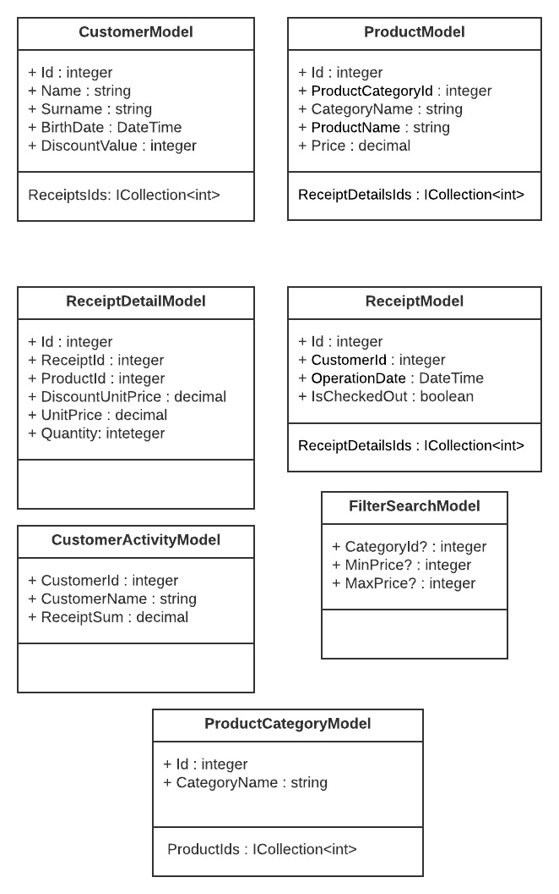

# BackEndTradeMarket

## Concept Idea
Supermarkets sell goods of various categories. The customers can shop anonymously or by logging in. When buying, a receipt is created with a list of goods purchased in a particular market.

## Description of features
- The program is fully covered with Unit tests.
- The programm was made with an onion architecture.
- The program was made taking into account all the SOLID principles.
- The program was made using different patterns.
- Special features:
    - Get most popular products.
    - Get the concrete number of most favourite products of customer.
    - Get the most active customers in a period of time.
    - Get the income of category in a period of time.

## Architecture

### Requirements
- NET 3.1 SDK
- ASP.NET 6
- IDE for C#(.NET). Rider(preferred) or Visual Studio 2019+

## Authors
Kolosov Serhii — [@MrSampy](www.t.me/MrSampy)

## Contributing
If you have any ideas for improving the program, feel free to add new Issues on the [Issues page](https://github.com/MrSampy/BackEndTradeMarket/issues).

You can also create Pull Requests on the [Pull Requests](https://github.com/MrSampy/BackEndTradeMarket/pulls) page.

## License
>**Note**: This program is distributed under an MIT License.

## Future
1. Add FrontEnd part.
2. Add more unique features. 
